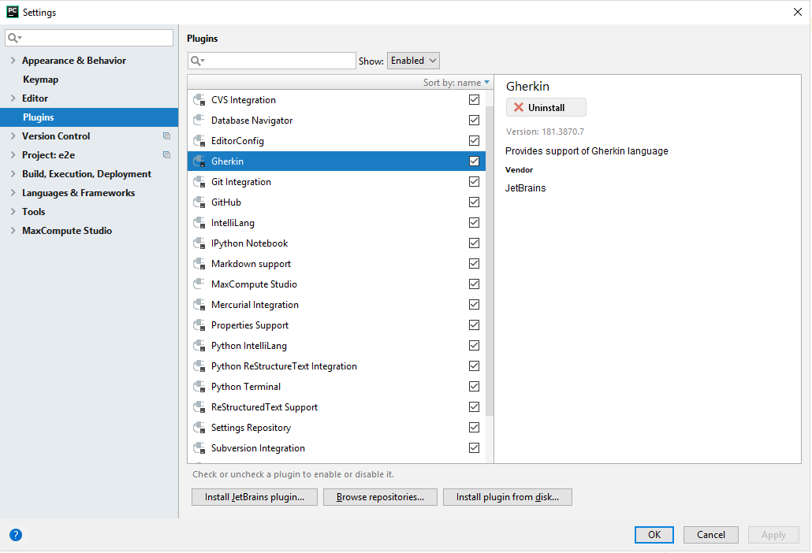
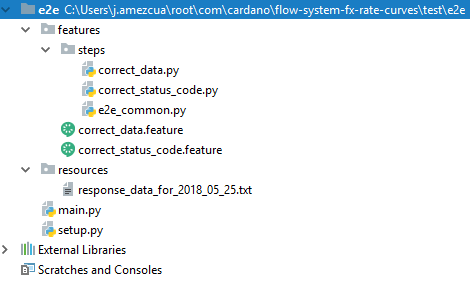

#Python BDD Testing with Jenkins support

This tutorial will explain how to run implement BDD with Python and Behave. Also how to run this in Jenkins avoiding some pitfalls and allowing the code to be aware of the environment.

##Background
Behave is a behavior driven development framework for Python. It uses Gherkin, a domain specific language that is business readable. This language lets you describe software's behaviour without detailing how that behaviour is implemented. For those with a Javascript background Gherkin is also used by Cucumber.

##Tool support
PyCharm has a "Gherkin" plugin that supports editing .feature files.

 

It provides .feature files with a specific icon in the project explorer.


It also provides syntax coloring for them.


##Project struture
This is the general layout of the project. In the root we have:

setup.py, the dependencies that we require to be installed and some metadata
main.py, launches our tests and if some extra configuration for behave would be needed this is the place to put it
features, in this folder we will store the .feature files containing the our BDD expressed requirements
features/steps, in this folder we will store our python files. For each .feature file we must have a Python file, i.e., "features/correct_data.feature" -> "features/steps/correct_data.py"
resources, if some other resources are needed like data to match some results this is the place to store them



##Feature files
The behavior of our software is going to be described using .feature files. Here is an example:

Feature: The flow returns the expected status codes

  Scenario: Run the flow with a valid date
    Given a date 2018-05-25
    When we make a post request to fx-rate-curves
    Then the response status code is 200
The keywords here are "Feature", "Scenario", "Given", "When", "Then", but there are two more "And" and "But", these are renamed by behave to take the name of their preceding step

Every line begins with a keyword and we have one keyword per line. "Feature" groups one or more "Scenario"s.

###Tags
An scenario may be tagged like in the code below with "@some_word". This can be used to run tagged scenarios.
@slow
Scenario: Run the flow with a bogus date
  Given a date bogus
  When we make a post request to fx-rate-curves
  Then the response status code is 500
With the command switch tags we can specify that we only want to run the scenarios that:

have one of the tags "tag1", "tag2", "tag3"
–-tags=tag1,tag2,tag3"
have all of the tags "tag1", "tag2", "tag3"
–-tags=tag1 –-tags=tag2 –-tags=tag3
This feature is compatible with the way main.py is implemented. This is explained below.

###Data driven testing
In case we are doing data driven testing we may include tables or chunks of text in the steps.

####Tables
They can be specified this way in the .feature files:
```gherkin
Scenario: some scenario
 Given a set of specific users
 | name | department | 
 | Barry | Beer Cans | 
 | Pudey | Silly Walks | 
 | Two-Lumps | Silly Walks |

 When we count the number of people in each department
 Then we will find two people in "Silly Walks"
 But we will find one person in "Beer Cans"
```
The table data will be stored in the "context.table" variable and will be accessed like this:
```python
@given('a set of specific users')
def step_impl(context):
    for row in context.table:
        model.add_user(name=row['name'], department=row['department'])
```
####Text
It can be specified this way in the .feature files:
```gherkin
Scenario: some scenario
 Given a sample text loaded into the frobulator
 """ 
 Lorem ipsum dolor sit amet, consectetur adipisicing elit, sed do
 eiusmod tempor incididunt ut labore et dolore magna aliqua.
 """ 
 When we activate the frobulator
 Then we will find it similar to English
 ```
##Step files
Each .feature file must have a corresponding .py file inside the "features/steps" folder and for every different step sentence in every feature a step must be implemented. Implementations may be reused between scenarios in the same .feature file.

For the previous example the step "Given a date 2018-05-25" is implemented by:
```python
@given("a date {date}")
def date_is_valid(context,date):
    context.date = date
```
As you can see, in every function we may pass a context variable and any other variables that we have created for the specific step:

context, global variable used to communicate information between steps. We can create more "fields" inside this object, i.e., context.date. Besides "context.table" and "context.text" there is another base filed "context.failed". With this variable we may test if a step has failed.
step variables, we define them in the step and take the value from the feature file, i.e., in the previous example we have a date variable that is going to be dealt with as a string and would take its value from the feature file as 2018-05-25. Other kinds of restrictions may be set on the variable types/content (see behave site documentation)
Environmental controls
We can also use fixtures just tagging some function with @fixture or specify code that we want to run:

* before each step, before_step(context, step)
* after each step, after_step(context, step)
* before each scenario, before_scenario(context, scenario)
* after each scenario, after_scenario(context, scenario)
* before each feature file, before_feature(context, feature)
* after each feature file, after_feature(context, feature)
* before a section tagged with the given name, before_tag(context, tag)
* after a section tagged with the given name, after_tag(context, tag)
* before begging the tests, before_all(context)
* after finishing the tests, after_all(context)
Here is some sample code where some environmental controls are used:
```python
from behave import fixture, use_fixture
from behave4my_project.fixtures import wsgi_server
from selenium import webdriver

@fixture
def selenium_browser_chrome(context):
    # -- HINT: @behave.fixture is similar to @contextlib.contextmanager
 context.browser = webdriver.Chrome()
    yield context.browser
    # -- CLEANUP-FIXTURE PART:
 context.browser.quit()

def before_all(context):
    use_fixture(selenium_browser_chrome, context)
    # -- HINT: CLEANUP-FIXTURE is performed after after_all() hook is called.

def before_feature(context, feature):
    model.init(environment='test')
´´´
##Runnning behave
The starting point for the behave tests is the main.py file. As you can see below, the only specific piece of code is running behave_main() and passing the exit code out. If the tests succeed will be zero and one if they do not.
```python
from sys import exit
from behave.__main__ import main as behave_main

if __name__ == "__main__":
    exit(behave_main())
```
Besides the --tags switch mentioned above other switches may be passed. For further information see the behave documentation.

##Jenkins integration
Running this kind of tests in Jenkins is easy. We just have to include a file named "Jenkinsfile" in the root of our Github repository and request from Jenkins to run "setup.py" and "main.py" in this order with the python interpreter (the code snippet for this is in the "Writing permissions" section below).

But integration poses three problems:

* dependencies must be downloaded
* writing permissions may cause problems when downloading the dependencies
* URL naming does not work the same, i.e., in your local machine the base URL for a NiFi flow may be "http://some_url" and "http://some_url_in_jenkins" in Jenkins. Having a more general view on this, things may change in case we have development, pre-production and production environments.
###Dependencies download
The "setup.py" file must contain the list of dependencies in the install_requires parameter.
```python
from setuptools import setup, find_packages

setup(
    name = "ndf-fx-rate-curves",
    version = "1.0",
    packages = find_packages(),
    include_package_data=True,
    url = 'https://github.com/cardano/flow-system-fx-rate-curves',
    description = "E2E testing for FxRatesCurvesWebApi NiFi flow. Basic testing for the REST endpoint, when data is stable testing the DB contents should be done",
    install_requires = ["behave", "requests"]
)
```


To run this you should setup how to run "setup.py". Pay attention to the "install" text in the "Parameters:" textbox.


###Writing permissions
This is solved by adding the "--user" switch. It writes to the user folder.
```groovy
stage('Run End to End test') {
    when { expression { return !fileExists('./.jenkinsTriggered') } }
    steps {
        dir('test/e2e') {
            sh 'python3.6 setup.py install --user'
            sh 'python3.6 main.py' 
        }
    }
}
```

###URL naming
This is solved with two actions:

declaring an environment variable in the Jenkinsfile. With a more general view in mind we could make this environment variable depend on the environment (dev, pre-prod, prod) or even make it specific for branch.
```groovy
environment {
    BASE_URL_IN_JENKINS = 'http://some_url_in_jenkins'
}
```
making the code aware of the existence of this variable:
from os import environ
```python
BASE_URL_IN_JENKINS_KEY = "BASE_URL_IN_JENKINS"
BASE_URL_IN_DEV = "http://some_url"
BASE_URL = environ.get(BASE_URL_IN_JENKINS_KEY) if BASE_URL_IN_JENKINS_KEY in environ else BASE_URL_IN_DEV
```

##Further information
The behave site extends the information provided here and explains other features: http://behave.readthedocs.io/en/latest/

The Jenkins site has more information regarding Jenkins: https://jenkins.io/doc/
